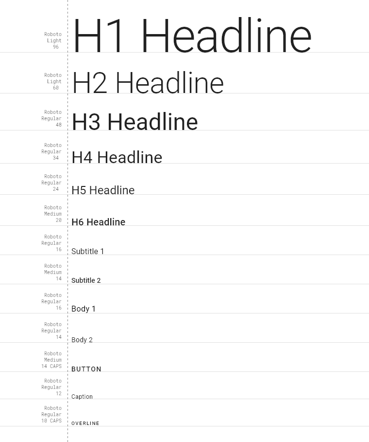
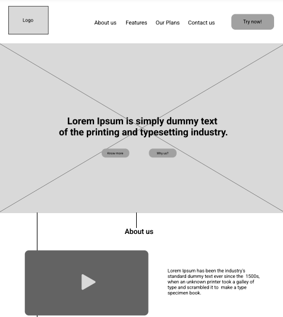
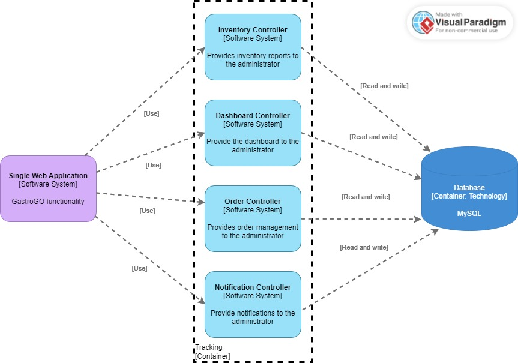
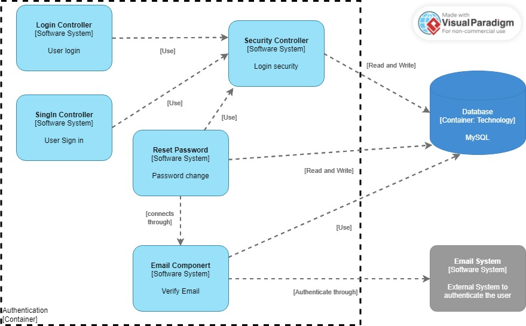

<div align="center">
  
  
  
Universidad Peruana de Ciencias Aplicadas  
  
Carrera: Ingeniería de Software  
  
Ciclo: 2024-02  
  
Curso: Aplicaciones Web   
  
Sección: WX53   
  
Profesor: Alberto Wilmer Sanchez Seña  
  
Informe del Trabajo Final  - TB1
  
Startup: DevDynasty  
  
Producto: GastroGo

### Team Members:

| Member                                | Code       |
|---------------------------------------|------------|
| Barrutia Vaez, Ricardo Andree         | U201714765 |
| Espinoza Inoñan, Fabiola Ximena       | U202214784 |
| Gongora Sanchez, Marco Antonio         | U20211A085 |
| Hurtado Palomino, Francisco Juan       | U202117498 |
| Loli Ramirez, Camila Cristina          | U202110385 |

  
**Agosto del 2024**
</div>
  
---  
# Registro de Versiones del Informe  

  
| Versión | Fecha      | Autor   | Descripción de modificaciones         |
|---------|------------|---------|---------------------------------------|
| 1.0     | 25/08/2024 | Barrutia Vaez, Ricardo Andree <br>	Espinoza Inoñan, Fabiola Ximena	<br> Gongora Sanchez, Marco Antonio	<br> Hurtado Palomino, Francisco Juan	<br> Loli Ramirez, Camila Cristina | Capítulo I <br> Capítulo II <br> Capítulo III <br> Capítulo IV <br> Capítulo V       |


---  
# Project Report Collaboration Insights  

Link del repositorio del reporte del TB1: https://github.com/G2-UPC-PRE-202402-SI730-WX53-DevDynasty/GastroGo-Report

Durante la realizacion informe, se realizaron reuniones y se asignaron los temas a desarrollar para la entrega correspondiente a los Capítulos I al V del Sprint 1, quedando organizados de la siguiente forma:

- Imágen de las Contribuciones del equipo: 
<td></img></td>
<p>Ricardo Barrutia</p>
- Imágen de las Contribuciones:
<td></img></td>
- Imágen de los Commits:
<td></img></td>

<p>Fabiola Espinoza</p>
- Imágen de las Contribuciones:
<td></img></td>
- Imágen de los Commits:
<td></img></td>

<p>Marco Gongora</p>
- Imágen de las Contribuciones:
<td></img></td>
- Imágen de los Commits:
<td></img></td>

<p>Francisco Hurtado</p>
- Imágen de las Contribuciones:
<td></img></td>
- Imágen de los Commits:
<td></img></td>

<p>Camila Loli</p>
- Imágen de las Contribuciones:
<td></img></td>
- Imágen de los Commits:
<td></img></td>


<br>

---  
# Student Outcome  
El curso contribuye al cumplimiento del Student Outcome ABET: **ABET – EAC - Student Outcome 3** <br> Criterio: *Capacidad de comunicarse efectivamente con un rango de audiencias.*  
  
En el siguiente cuadro se describe las acciones realizadas y enunciados de conclusiones por parte del grupo, que permiten sustentar el haber alcanzado el logro del ABET – EAC - Student Outcome 3.  
  
| Criterio específico | Acciones realizadas | Conclusiones |  
| - | - | - |  
| Participa en equipos multidisciplinarios con eficacia, eficiencia y objetividad, en el marco de un proyecto en soluciones de ingeniería de software. | ***TB1:***  <br> **Barrutia Vaez, Ricardo Andree** <br><br> **Espinoza Inoñan, Fabiola Ximena** <br><br>  **Gongora Sanchez, Marco Antonio** <br><br> **Hurtado Palomino, Francisco Juan** <br><br> **Loli Ramirez, Camila Cristina** <br><br>  | En conclusion .... |
| Conoce al menos un sector empresarial o dominio de aplicación de soluciones de software. |  ***TB1:***  <br> **Barrutia Vaez, Ricardo Andree** <br><br> **Espinoza Inoñan, Fabiola Ximena** <br><br>  **Gongora Sanchez, Marco Antonio** <br><br> **Hurtado Palomino, Francisco Juan** <br><br> **Loli Ramirez, Camila Cristina** <br><br>| En conclusion .... |
  
---  
# Contenido  
## Tabla de contenidos  
  
### [Capítulo I: Introducción]()  
- [1.1. Startup Profile]()  
  - [1.1.1 Descripción de la Startup]()  
  - [1.1.2 Perfiles de integrantes del equipo]()  
- [1.2 Solution Profile]()  
  - [1.2.1 Antecedentes y problemática]()  
  - [1.2.2 Lean UX Process]()  
      - [1.2.2.1. Lean UX Problem Statements]()  
      - [1.2.2.2. Lean UX Assumptions]()  
      - [1.2.2.3. Lean UX Hypothesis Statements]()  
      - [1.2.2.4. Lean UX Canvas]()  
- [1.3. Segmentos objetivo]()  
  
### [Capítulo II: Requirements Elicitation & Analysis]()  
- [2.1. Competidores]()  
  - [2.1.1. Análisis competitivo]()  
  - [2.1.2. Estrategias y tácticas frente a competidores]()  
- [2.2. Entrevistas]()  
  - [2.2.1. Diseño de entrevistas]()  
  - [2.2.2. Registro de entrevistas]()  
  - [2.2.3. Análisis de entrevistas]()  
- [2.3. Needfinding]()  
  - [2.3.1. User Personas]()  
  - [2.3.2. User Task Matrix]()  
  - [2.3.3. User Journey Mapping]()  
  - [2.3.4. Empathy Mapping]()  
  - [2.3.5. As-is Scenario Mapping]()  
- [2.4. Ubiquitous Language]()  
  
### [Capítulo III: Requirements Specification]()  
- [3.1. To-Be Scenario Mapping]()  
- [3.2. User Stories]()  
- [3.3. Impact Mapping]()  
- [3.4. Product Backlog]()  
  
  
### [Capítulo IV: Product Design]()  
- [4.1. Style Guidelines]()  
  - [4.1.1. General Style Guidelines]()  
  - [4.1.2. Web Style Guidelines]()  
- [4.2. Information Architecture]()  
  - [4.2.1. Organization Systems]()  
  - [4.2.2. Labeling Systems]()  
  - [4.2.3. SEO Tags and Meta Tags]()  
  - [4.2.4. Searching Systems]()  
  - [4.2.5. Navigation Systems]()  
- [4.3. Landing Page UI Design]()  
  - [4.3.1. Landing Page Wireframe]()  
  - [4.3.2. Landing Page Mock-up]()  
- [4.4. Web Applications UX/UI Design]()  
  - [4.4.1. Web Applications Wireframes]()  
  - [4.4.2. Web Applications Wireflow Diagrams]()  
  - [4.4.3. Web Applications Mock-ups]()  
  - [4.4.4. Web Applications User Flow Diagrams]()  
- [4.5. Web Applications Prototyping]()  
- [4.6. Domain-Driven Software Architecture]()  
  - [4.6.1. Software Architecture Context Diagram]()  
  - [4.6.2. Software Architecture Container Diagrams]()  
  - [4.6.3. Software Architecture Components Diagrams]()  
- [4.7. Software Object-Oriented Design]()  
  - [4.7.1. Class Diagrams]()  
  - [4.7.2. Class Dictionary]()  
- [4.8. Database Design]()  
  - [4.8.1. Database Diagram]()  
  
  
### [Capítulo V: Product Implementation, Validation & Deployment]()  
- [5.1. Software Configuration Management]()  
  - [5.1.1. Software Development Environment Configuration]()  
  - [5.1.2. Source Code Management]()  
  - [5.1.3. Source Code Style Guide & Conventions]()  
  - [5.1.4. Software Deployment Configuration]()  
- [5.2. Landing Page, Services & Applications Implementation]()  
  - [5.2.1. Sprint 1]()  
      - [5.2.1.1. Sprint Planning 1]()  
      - [5.2.1.2. Sprint Backlog 1]()  
      - [5.2.1.3. Development Evidence for Sprint Review]()  
      - [5.2.1.4. Testing Suite Evidence for Sprint Review]()  
      - [5.2.1.5. Execution Evidence for Sprint Review]()  
      - [5.2.1.6. Services Documentation Evidence for Sprint Review]()  
      - [5.2.1.7. Software Deployment Evidence for Sprint Review]()  
      - [5.2.1.8. Team Collaboration Insights during Sprint]()  
  - [5.2.2. Sprint 2]()  
      - [5.2.2.1. Sprint Planning 2]()  
      - [5.2.2.2. Sprint Backlog 2]()  
      - [5.2.2.3. Development Evidence for Sprint Review]()  
      - [5.2.2.4. Testing Suite Evidence for Sprint Review]()  
      - [5.2.2.5. Execution Evidence for Sprint Review]()  
      - [5.2.2.6. Services Documentation Evidence for Sprint Review]()  
      - [5.2.2.7. Software Deployment Evidence for Sprint Review]()  
      - [5.2.2.8. Team Collaboration Insights during Sprint]()  
  - [5.2.3. Sprint 3]()  
      - [5.2.3.1. Sprint Planning 3]()  
      - [5.2.3.2. Sprint Backlog 3]()  
      - [5.2.3.3. Development Evidence for Sprint Review]()  
      - [5.2.3.4. Testing Suite Evidence for Sprint Review]()  
      - [5.2.3.5. Execution Evidence for Sprint Review]()  
      - [5.2.3.6. Services Documentation Evidence for Sprint Review]()  
      - [5.2.3.7. Software Deployment Evidence for Sprint Review]()  
      - [5.2.3.8. Team Collaboration Insights during Sprint]()  
  - [5.2.4. Sprint 4]()  
      - [5.2.4.1. Sprint Planning 4]()  
      - [5.2.4.2. Sprint Backlog 4]()  
      - [5.2.4.3. Development Evidence for Sprint Review]()  
      - [5.2.4.4. Testing Suite Evidence for Sprint Review]()  
      - [5.2.4.5. Execution Evidence for Sprint Review]()  
      - [5.2.4.6. Services Documentation Evidence for Sprint Review]()  
      - [5.2.4.7. Software Deployment Evidence for Sprint Review]()  
      - [5.2.4.8. Team Collaboration Insights during Sprint]()  
- [5.3. Validation Interviews]()  
  - [5.3.1. Diseño de Entrevistas]()  
  - [5.3.2. Registro de Entrevistas]()  
  - [5.3.3. Evaluaciones según heurísticas]()  
- [5.4. Video About-the-Product]()  
  
---  
# Capítulo I: Introducción  
## 1.1. Startup Profile  
### 1.1.1 Descripción de la Startup  
### 1.1.2 Perfiles de integrantes del equipo  
## 1.2 Solution Profile  
### 1.2.1 Antecedentes y problemática  
### 1.2.2 Lean UX Process  
#### 1.2.2.1. Lean UX Problem Statements  
#### 1.2.2.2. Lean UX Assumptions  
#### 1.2.2.3. Lean UX Hypothesis Statements  
#### 1.2.2.4. Lean UX Canvas  
## 1.3. Segmentos objetivo  
# Capítulo II: Requirements Elicitation & Analysis  
## 2.1 Competidores  
## 2.2. Entrevistas  
### 2.2.1. Diseño de entrevistas  
### 2.2.2. Registro de entrevistas  
### 2.2.3. Análisis de entrevistas  
## 2.3. Needfinding  
### 2.3.1. User Personas  
### 2.3.2. User Task Matrix  
### 2.3.3. User Journey Mapping  
### 2.3.4. Empathy Mapping  
### 2.3.5. As-is Scenario Mapping  
## 2.4. Ubiquitous Language  
# Capítulo III: Requirements Specification  
## 3.1. To-Be Scenario Mapping  
## 3.2. User Stories  
## 3.3. Impact Mapping  
## 3.4. Product Backlog  
# Capítulo IV: Product Design  
# Capítulo IV: Product Design

Este capítulo se plantea en el proceso de diseño de los productos digitales que brinda DevDynasty. Asimismo, se enfocará en el diseño visual y la arquitectura de la información con la que se alinearán los productos para crear interfaces de usuario (UI) y experiencias de usuario (UX) efectivas.
## 4.1. Style Guidelines.

En este segmento, se detallarán las guías de estilo específicas para la landing page y aplicación web. Esto será esencial para mantener coherencia en la apariencia visual de los elementos presentes en nuestros productos.
### 4.1.1. General Style Guidelines.

**Branding**:

*Brand Overview*
GastroGo es una plataforma diseñada para simplificar el procedo de pedidos de almuerzos (comúnmente conocido como menús) para distintos grupos de trabajadores dentro de empresas. Nuestro objetivo es ofrecer al usuario una experiencia fluida para los restaurantes asociados y a los empleados de distintas empresas de la capital. Nos aseguramos que de los empleados puedan obtener un almuerzo de su agrado y facilidad al momento de pedir y recibir. Asimismo, nos enfocamos en brindar a los restaurantes la oportunidad de expandir su clientela en el rubro.

*Brand Name*
GastroGo utiliza "Gastro" (abreviatura de la palabra gastronomía) y "Go" (ir en la traducción al español) para transmitir la idea de la aplicación de manera rápida. Tener la abreviación de gastronomía indica, inmediatamente, que la aplicación está enfocada en alimentos. Asimismo, se tiene en cuenta el "go" porque esta palabra suele estar relacionada con movilidad y rapidez. Es por ello que el nombre es fácil de entender desde la perspectiva del usuario, sabrá instantáneamente que el producto es sobre pedidos de comida. Al ser un nombre llamativo, permitirá que captemos la atención de un amplio número de usuarios interesados en encontrar una solución rápida de comida.

A continuación, se mostrará el logo:


Se utilizó el nombre completo de la aplicación debido a que es corta y fácil de recordar. También, el uso de un tenedor como imagen central representa los pedidos de comida que se pueden realizar. Incluimos unas líneas que parten del punto central a distintos círculos, esto representa que la conexión que permite GastroGo, de los restaurantes a varios grupos de empleados con la necesidad de recibir su comida para la hora del almuerzo.

**Typography:**

Se utilizó la fuente Roboto debido a su facilidad al momento de leer. Roboto es una fuente bastante utilizada en la mayoría de aplicaciones debido a la legibilidad que presenta. Para utilizarla, tuvimos en cuento el tamaño de letra para los cuatro niveles necesarios para nuestros productos que son los encabezados, cuerpo de texto, botones y enlaces.

 <br>

*Typescale recuperado de: https://m2.material.io/design/typography/the-type-system.html*

**Colors:**

Para poder escoger los colores representativos de la aplicación, decidimos basarnos en los efectos que puede producir en los usuarios al momento de verlo. En este caso, se utilizaron los colores azul y naranja, de ahí partimos para crear la paleta de colores. La razón para escoger el azul es porque representa seguridad y es bastante popular en varias aplicaciones reconocidas. Además, es un color calmado, permite que el usuario se sienta cómodo al momento de navegar. Asimismo, decidimos agregar el color naranja como color secundario debido a la calidez que emite al usuario. La razón por la cuál se escogió el naranja es porque es más llamativo, por ello es que preferimos colocarlo en los call to action. Enlace a la paleta: https://www.figma.com/design/HGjzWSvewN97ZBYXu5FkdL/ApplicationWeb?node-id=0-1&t=9bAg56CXCBc09MeI-1

 <br>

*Color Palette recuperado de: https://material.io/design/color/the-color-system.html#color-theme-creation*

 <br>

**Spacing:**

El spacing a considerar para mantener el contenido entendible será:
* Button padding: 16 px (vertical), 26 px (vertical)
* Input fields: 40 px (altura), 20 px (espacio entre campos)
* Margin entre secciones: 60 px
* Height entre textos: 30 px

**Dimensions:**

Se prefirió utilizar un tono amigable y cercano, sin dejar de lado el respeto a los usuarios. GastroGo busca ser concisa en la comunicación, buscamos persuadir a los usuarios sin necesidad de ser muy serios, ya que esto podría causar un poco de incomodidad a los potenciales clientes.

### 4.1.2. Web Style Guidelines.

Se creó una guía específica a seguir para los productos a presentar. Esto incluye los componentes a utilizar en la página web. Tenemos en cuenta la paleta de colores mencionadas con anterioridad. De esta forma, buscamos llamar la atención de los usuarios, esto permite que puedan navegar los productos con más interés. Enlace al esquema: https://www.figma.com/design/HGjzWSvewN97ZBYXu5FkdL/ApplicationWeb?node-id=0-1&t=9bAg56CXCBc09MeI-1

 <br>

## 4.2. Information Architecture.

En este segmento se explicará la organización escogida para el producto, las etiquetas y la forma de navegación dentro de la plataforma, de esta forma garantiza una experiencia amigable para los usuarios y facilidad de encontrar la información que deseen.

### 4.2.1. Organization Systems.

**Visual Organization**

Se decidió utilizar la jerarquía visual para organizar la información del contenido en los productos, de esta forma, el usuario podría discernir lo que tiene más relevancia. Es por ello que el tamaño de texto varía dependiendo de la importancia de cada oración presente. Por ejemplo, se escogió para los encabezados importantes entre los tamaños 48px - 40px, para los subtítulos 32px - 24px y para los párrafos 16px - 14px. También, se consideró la organización secuencial, para guiar al usuario al momento de realizar el pago de su suscripción en la aplicación web.

**Categorization Schemes**

Para la categorización, se escogieron dos esquemas:

**Alfabético**

La información de los restaurantes, cuando se presente los recuadros de cada uno para los trabajadores, se organizará alfabéticamente. Esto permite que la información esté más ordenada y sea cómodo para el cliente.

**Cronológico**

La información de los pedidos para cada restaurante será de manera cronológica, el primer pedido que reciban, será puesto en la parte superior de la lista y, consecuentemente, seguirán los nuevos pedido. Así, mantendremos un orden justo para realizar los almuerzos acorde a el orden de llegada.

**Audiencia**

Acorde a los segmentos objetivos que tenemos: restaurantes dispuestos a presentar sus negocios en la aplicación y los grupos de trabajadores, hemos decidido que cada uno vea su respectiva información, porque esta varía debido a que sus metas con la aplicación son distintas. De esta forma, evitamos confusiones al momento de presentar sus respectivos beneficios.

### 4.2.2. Labeling Systems.

Para etiquetar los ciertos botones y funcionalidades presentes en la aplicación web decidimos buscar una opción que permita al usuario intuir que implica cada uno. Es por ello que hemos escogido los que están presentes en Prime Vue (https://primevue.org/icons) para la aplicación web debido a que son fáciles de entender y están relacionadas a lo que representan las funcionalidades. En el caso de la landing page, solo vamos a utilizar íconos para las redes sociales (Instagram, Facebook, X, etc.) disponibles para que se contacten con nosotros.

### 4.2.3. SEO Tags and Meta Tags

Hemos utilizado palabras claves para optimizar nuestros SEO Tags y Meta Tags para los motores de búsqueda, así mejoraremos la visibilidad de nuestra página y aplicación web.

**Landing Page**

```
<meta charset="UTF-8">
<meta name="viewport" content="width=devide-width, initial-scale=1.0> // for mobile
<title>GastroGo - Corporate ordering platform</title>
<meta name="description" content="Discover the best local restaurants at the palm of your hand and order a good meal for you and your team with GastroGo!">
<meta name="keywords" content="local restaurants, online ordering, food delivery, GastroGo>
<meta name="author" content="DevDynasty">
```

**Web Application**

```
<meta charset="UTF-8">
<meta name="viewport" content="width=devide-width, initial-scale=1.0> // for mobile
<title>GastroGo - Corporate ordering platform</title>
<meta name="description" content="Order your dishes, manage your orders, track deliveries and explore all the restaurants available with GastroGo! Start now!">
<meta name="keywords" content="local restaurants, online ordering, food delivery, order tracking, GastroGo>
<meta name="author" content="DevDynasty">
```

### 4.2.4. Searching Systems.

Para el sistema de búsqueda interno, en la aplicación web, se implementarán distintos filtros para mejorar la experiencia del usuario:
* En el caso de los grupos de trabajadores que estén buscando una comida en específico, podrán utilizar filtros para determinar el tipo de almuerzo que busquen. Por ejemplo: comida vegetariana, sin gluten, dietético, etc.
  * No solo sería en términos de comida, también al momento de buscar los restaurantes con más estrellas.
  * También tendrán la opción de buscar restaurantes que ellos ya sepan, de esta forma, es más accesible la información de cada local.

### 4.2.5. Navigation Systems.

Para la navegación se crearán menús principales que sean claros para facilitar el proceso a los usuarios de ambos segmentos. Dependiendo del usuario, se determinará el menú y tendrá botones para acceder a las distintas funcionalidades presentes en la aplicación.

## 4.3. Landing Page UI Design 

En esta sección mostraremos el proceso de diseño para nuestra landing page, desde los wireframes hasta los mock-ups. Hemos tenido en cuenta las reglas determinadas en la guía de estilo para mantener la coherencia visual en la página y que sea fácil de relacionar con la aplicación web.

### 4.3.1. Landing Page Wireframe

En esta sección se presentarán los wireframes de la landing page. Estos wireframes son esquemas de baja fidelidad que muestran la estructura de la página, sin tener en cuenta la paleta de colores ni las imágenes que se utilizarán. Enlace al Figma: https://www.figma.com/design/HGjzWSvewN97ZBYXu5FkdL/ApplicationWeb?node-id=1-3&t=wDYwqq80w6CGC5hD-1

Para Desktop Browser:


### 4.3.2. Landing Page Mock-up

En esta sección se presentarán los mock-ups de la landing page. Estos mock-ups son esquemas de alta fidelidad que muestran la estructura de la página, todas las guías de estilo indicadas en las secciones anteriores están presentes en estos esquemas. Enlace al Figma: https://www.figma.com/design/HGjzWSvewN97ZBYXu5FkdL/ApplicationWeb?node-id=1-3&t=wDYwqq80w6CGC5hD-1

Para Desktop Browser:


## 4.4. Web Applications UX/UI Design  
### 4.4.1. Web Applications Wireframes  
### 4.4.2. Web Applications Wireflow Diagrams  
### 4.4.3. Web Applications Mock-ups  
### 4.4.4. Web Applications User Flow Diagrams  
## 4.5. Web Applications Prototyping  
## 4.6. Domain-Driven Software Architecture  
### 4.6.1. Software Architecture Context Diagram  
Context diagram:


### 4.6.2. Software Architecture Container Diagrams  
Container diagram:


### 4.6.3. Software Architecture Components Diagrams  
Tracking component diagram:




Sales component diagram:


Payment component diagram:


Authentication component diagram:


## 4.7. Software Object-Oriented Design  
### 4.7.1. Class Diagrams  
Class diagram:


### 4.7.2. Class Dictionary  
El sistema tiene las siguientes clases: Usuario (ID, nombre, correo, contraseña, rol, suscripción; métodos: registrarse, iniciar sesión, actualizar perfil, cancelar suscripción), relacionado con Pedido (ID, fecha, estado, total, participantes, método de pago; métodos: crear, actualizar, cancelar, dividir costos; asociado a Suscripción, Restaurante y Pago). Suscripción (ID, tipo, precio, beneficios, fecha inicio, expiración; métodos: crear, renovar, cancelar) está vinculado a Pedido. Restaurante (ID, nombre, dirección, menú; métodos: agregar, actualizar, eliminar platos) tiene muchos Platos y recibe muchos Pedidos. Plato (ID, nombre, descripción, precio, categoría; métodos: crear, actualizar, eliminar) está vinculado a Votación. Votación (ID, código, platos, estado, participantes) se relaciona con Usuario y Plato. Pago (ID, monto, estado, método) está asociado a Pedido. Notificación (ID, tipo, mensaje) se asocia a Usuario y Pedido.
## 4.8. Database Design  
### 4.8.1. Database Diagram
Database diagram:


# Capítulo V: Product Implementation, Validation & Deployment  
## 5.1. Software Configuration Management  
### 5.1.1. Software Development Environment Configuration  
  
### 5.1.2. Source Code Management  
  
### 5.1.3. Source Code Style Guide & Conventions  
  
### 5.1.4. Software Deployment Configuration  
  
## 5.2. Landing Page, Services & Applications Implementation  
### 5.2.1. Sprint 1  
#### 5.2.1.1. Sprint Planning 1  
  
#### 5.2.1.2. Sprint Backlog 1  
  
#### 5.2.1.3. Development Evidence for Sprint Review  
  
#### 5.2.1.4. Testing Suite Evidence for Sprint Review  
  
#### 5.2.1.5. Execution Evidence for Sprint Review  
  
#### 5.2.1.6. Services Documentation Evidence for Sprint Review  
  
#### 5.2.1.7. Software Deployment Evidence for Sprint Review  
  
#### 5.2.1.8. Team Collaboration Insights during Sprint  
  
# Conclusiones  
### Conclusiones y recomendaciones  
### Video About-the-Team  
  
---  
# Bibliografía  
- Altametrics. (n.d.). Common challenges in restaurant operations and supply chain management. Altametrics. 
https://altametrics.com/topics/common-challenges-in-restaurant-operations-and-supply-chain-management/ 

- Picker Express. (n.d.). Logística en restaurantes. Picker Express. <br>
https://www.pickerexpress.com/blog/logistica-en-restaurantes 

- Universidad Científica del Sur. (2021). Análisis de la cadena de suministro en restaurantes de Lima Metropolitana (Tesis de licenciatura). Repositorio Institucional de la Universidad Científica del Sur.<br> https://repositorio.cientifica.edu.pe/handle/20.500.12805/728 

- Built In. (2023). How Cheetah and Choco are transforming the food supply chain. Built In.<br> https://builtin.com/articles/food-supply-chain-cheetah-choco 

- Euromonitor International. (2023). Limited-service restaurants in Peru. Euromonitor International. <br>https://www.euromonitor.com/limited-service-restaurants-in-peru/report 

---  
# Anexos
- Enlace de la Organización de Github: https://github.com/G2-UPC-PRE-202402-SI730-WX53-DevDynasty/GastroGo-Report
- Videos de Exposiciones:
- TB1:
