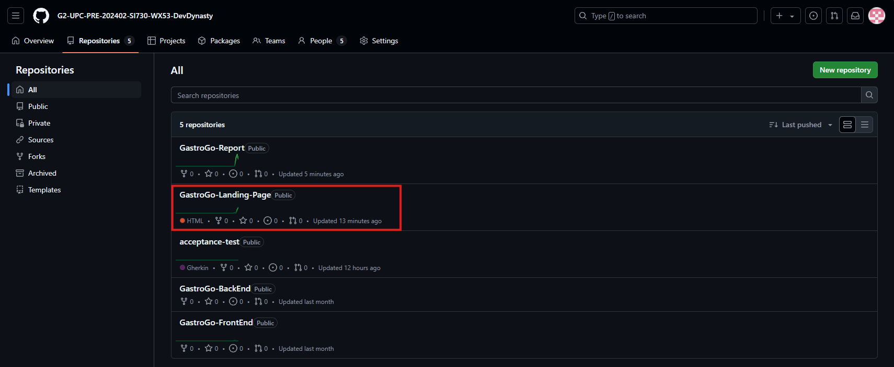
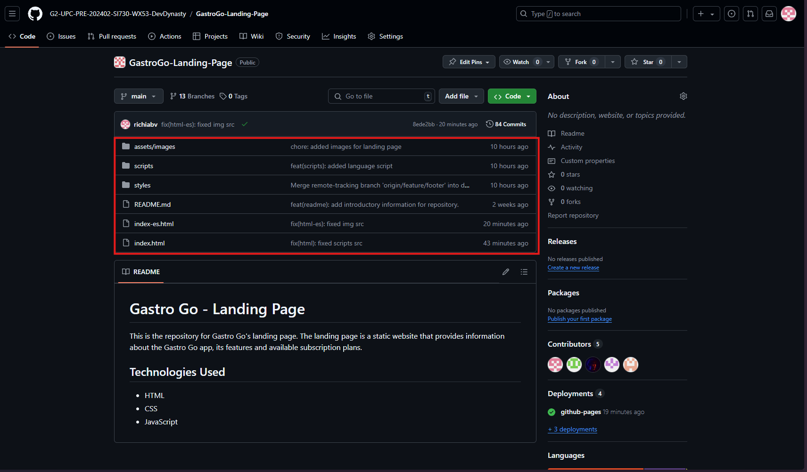
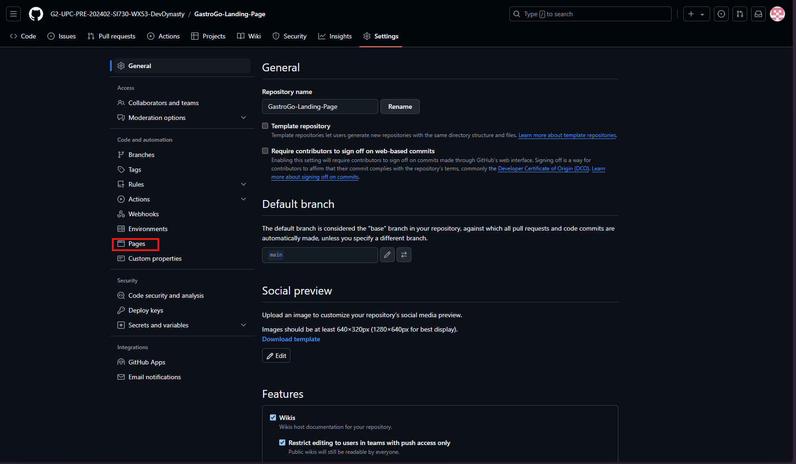
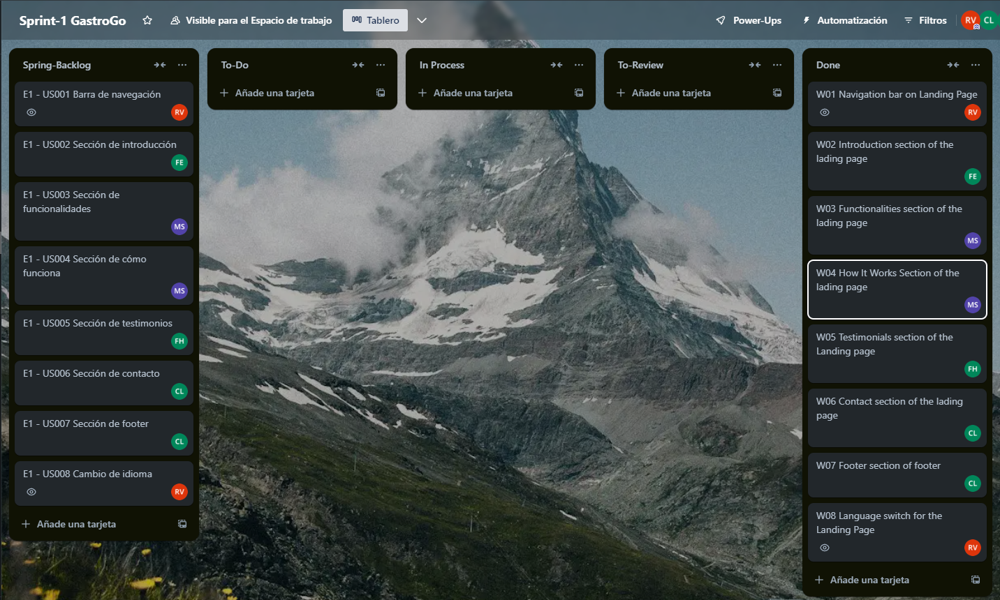
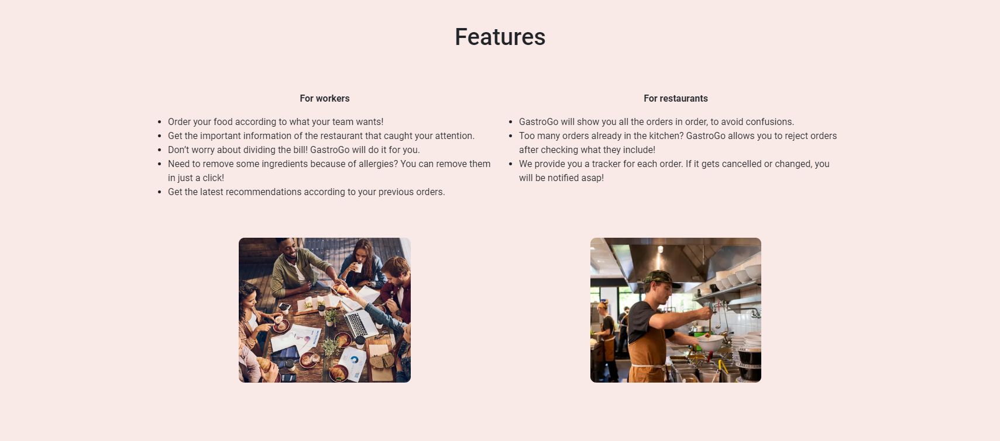
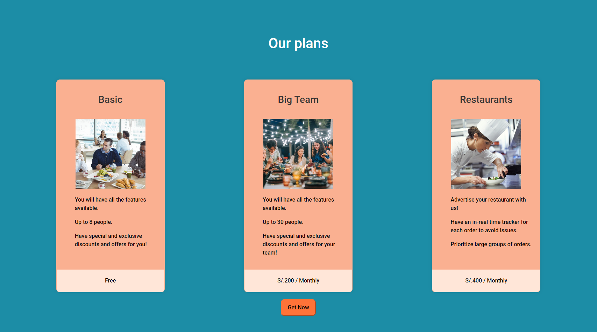

  
  
  
Universidad Peruana de Ciencias Aplicadas  
  
Carrera: Ingeniería de Software  
  
Ciclo: 2024-02  
  
Curso: Aplicaciones Web   
  
Sección: WX53   
  
Profesor: Alberto Wilmer Sanchez Seña  
  
Informe del Trabajo Final  - TB1
  
Startup: DevDynasty  
  
Producto: GastroGo

### Team Members:

| Member                                | Code       |
|---------------------------------------|------------|
| Barrutia Vaez, Ricardo Andree         | U201714765 |
| Espinoza Inoñan, Fabiola Ximena       | U202214784 |
| Gongora Sanchez, Marco Antonio         | U20211A085 |
| Hurtado Palomino, Francisco Juan       | U202117498 |
| Loli Ramirez, Camila Cristina          | U202110385 |

  
**Agosto del 2024**

  
---  
# Registro de Versiones del Informe  

  
| Versión | Fecha      | Autor   | Descripción de modificaciones         |
|---------|------------|---------|---------------------------------------|
| 1.0     | 25/08/2024 | Barrutia Vaez, Ricardo Andree  	Espinoza Inoñan, Fabiola Ximena	  Gongora Sanchez, Marco Antonio	  Hurtado Palomino, Francisco Juan	  Loli Ramirez, Camila Cristina | Capítulo I   Capítulo II   Capítulo III   Capítulo IV   Capítulo V       |

---  
# Project Report Collaboration Insights  

Link del repositorio del reporte del TB1: https://github.com/G2-UPC-PRE-202402-SI730-WX53-DevDynasty/GastroGo-Report

Durante la realizacion informe, se realizaron reuniones y se asignaron los temas a desarrollar para la entrega correspondiente a los Capítulos I al V del Sprint 1, quedando organizados de la siguiente forma:

- Imágen de las Contribuciones del equipo: 

---  
# Student Outcome  
El curso contribuye al cumplimiento del Student Outcome ABET: **ABET – EAC - Student Outcome 3**   Criterio: *Capacidad de comunicarse efectivamente con un rango de audiencias.*  
  
En el siguiente cuadro se describe las acciones realizadas y enunciados de conclusiones por parte del grupo, que permiten sustentar el haber alcanzado el logro del ABET – EAC - Student Outcome 3.  
  
| Criterio específico | Acciones realizadas | Conclusiones |  
| - | - | - |  
| Participa en equipos multidisciplinarios con eficacia, eficiencia y objetividad, en el marco de un proyecto en soluciones de ingeniería de software. | ***TB1:***    **Barrutia Vaez, Ricardo Andree**    **Espinoza Inoñan, Fabiola Ximena**     **Gongora Sanchez, Marco Antonio**    **Hurtado Palomino, Francisco Juan**    **Loli Ramirez, Camila Cristina**     | En conclusion .... |
| Conoce al menos un sector empresarial o dominio de aplicación de soluciones de software. |  ***TB1:***    **Barrutia Vaez, Ricardo Andree**    **Espinoza Inoñan, Fabiola Ximena**     **Gongora Sanchez, Marco Antonio**    **Hurtado Palomino, Francisco Juan**    **Loli Ramirez, Camila Cristina**   | En conclusion .... |
  
---  
# Contenido  
## Tabla de contenidos  
  
### [Capítulo I: Introducción]()  
- [1.1. Startup Profile]()  
  - [1.1.1 Descripción de la Startup]()  
  - [1.1.2 Perfiles de integrantes del equipo]()  
- [1.2 Solution Profile]()  
  - [1.2.1 Antecedentes y problemática]()  
  - [1.2.2 Lean UX Process]()  
      - [1.2.2.1. Lean UX Problem Statements]()  
      - [1.2.2.2. Lean UX Assumptions]()  
      - [1.2.2.3. Lean UX Hypothesis Statements]()  
      - [1.2.2.4. Lean UX Canvas]()  
- [1.3. Segmentos objetivo]()  
  
### [Capítulo II: Requirements Elicitation & Analysis]()  
- [2.1. Competidores]()  
  - [2.1.1. Análisis competitivo]()  
  - [2.1.2. Estrategias y tácticas frente a competidores]()  
- [2.2. Entrevistas]()  
  - [2.2.1. Diseño de entrevistas]()  
  - [2.2.2. Registro de entrevistas]()  
  - [2.2.3. Análisis de entrevistas]()  
- [2.3. Needfinding]()  
  - [2.3.1. User Personas]()  
  - [2.3.2. User Task Matrix]()  
  - [2.3.3. User Journey Mapping]()  
  - [2.3.4. Empathy Mapping]()  
  - [2.3.5. As-is Scenario Mapping]()  
- [2.4. Ubiquitous Language]()  
  
### [Capítulo III: Requirements Specification]()  
- [3.1. To-Be Scenario Mapping]()  
- [3.2. User Stories]()  
- [3.3. Impact Mapping]()  
- [3.4. Product Backlog]()  
  
  
### [Capítulo IV: Product Design]()  
- [4.1. Style Guidelines]()  
  - [4.1.1. General Style Guidelines]()  
  - [4.1.2. Web Style Guidelines]()  
- [4.2. Information Architecture]()  
  - [4.2.1. Organization Systems]()  
  - [4.2.2. Labeling Systems]()  
  - [4.2.3. SEO Tags and Meta Tags]()  
  - [4.2.4. Searching Systems]()  
  - [4.2.5. Navigation Systems]()  
- [4.3. Landing Page UI Design]()  
  - [4.3.1. Landing Page Wireframe]()  
  - [4.3.2. Landing Page Mock-up]()  
- [4.4. Web Applications UX/UI Design]()  
  - [4.4.1. Web Applications Wireframes]()  
  - [4.4.2. Web Applications Wireflow Diagrams]()  
  - [4.4.3. Web Applications Mock-ups]()  
  - [4.4.4. Web Applications User Flow Diagrams]()  
- [4.5. Web Applications Prototyping]()  
- [4.6. Domain-Driven Software Architecture]()  
  - [4.6.1. Software Architecture Context Diagram]()  
  - [4.6.2. Software Architecture Container Diagrams]()  
  - [4.6.3. Software Architecture Components Diagrams]()  
- [4.7. Software Object-Oriented Design]()  
  - [4.7.1. Class Diagrams]()  
  - [4.7.2. Class Dictionary]()  
- [4.8. Database Design]()  
  - [4.8.1. Database Diagram]()  
  
  
### [Capítulo V: Product Implementation, Validation & Deployment]()  
- [5.1. Software Configuration Management]()  
  - [5.1.1. Software Development Environment Configuration]()  
  - [5.1.2. Source Code Management]()  
  - [5.1.3. Source Code Style Guide & Conventions]()  
  - [5.1.4. Software Deployment Configuration]()  
- [5.2. Landing Page, Services & Applications Implementation]()  
  - [5.2.1. Sprint 1]()  
      - [5.2.1.1. Sprint Planning 1]()  
      - [5.2.1.2. Sprint Backlog 1]()  
      - [5.2.1.3. Development Evidence for Sprint Review]()  
      - [5.2.1.4. Testing Suite Evidence for Sprint Review]()  
      - [5.2.1.5. Execution Evidence for Sprint Review]()  
      - [5.2.1.6. Services Documentation Evidence for Sprint Review]()  
      - [5.2.1.7. Software Deployment Evidence for Sprint Review]()  
      - [5.2.1.8. Team Collaboration Insights during Sprint]()  
  - [5.2.2. Sprint 2]()  
      - [5.2.2.1. Sprint Planning 2]()  
      - [5.2.2.2. Sprint Backlog 2]()  
      - [5.2.2.3. Development Evidence for Sprint Review]()  
      - [5.2.2.4. Testing Suite Evidence for Sprint Review]()  
      - [5.2.2.5. Execution Evidence for Sprint Review]()  
      - [5.2.2.6. Services Documentation Evidence for Sprint Review]()  
      - [5.2.2.7. Software Deployment Evidence for Sprint Review]()  
      - [5.2.2.8. Team Collaboration Insights during Sprint]()  
  - [5.2.3. Sprint 3]()  
      - [5.2.3.1. Sprint Planning 3]()  
      - [5.2.3.2. Sprint Backlog 3]()  
      - [5.2.3.3. Development Evidence for Sprint Review]()  
      - [5.2.3.4. Testing Suite Evidence for Sprint Review]()  
      - [5.2.3.5. Execution Evidence for Sprint Review]()  
      - [5.2.3.6. Services Documentation Evidence for Sprint Review]()  
      - [5.2.3.7. Software Deployment Evidence for Sprint Review]()  
      - [5.2.3.8. Team Collaboration Insights during Sprint]()  
  - [5.2.4. Sprint 4]()  
      - [5.2.4.1. Sprint Planning 4]()  
      - [5.2.4.2. Sprint Backlog 4]()  
      - [5.2.4.3. Development Evidence for Sprint Review]()  
      - [5.2.4.4. Testing Suite Evidence for Sprint Review]()  
      - [5.2.4.5. Execution Evidence for Sprint Review]()  
      - [5.2.4.6. Services Documentation Evidence for Sprint Review]()  
      - [5.2.4.7. Software Deployment Evidence for Sprint Review]()  
      - [5.2.4.8. Team Collaboration Insights during Sprint]()  
- [5.3. Validation Interviews]()  
  - [5.3.1. Diseño de Entrevistas]()  
  - [5.3.2. Registro de Entrevistas]()  
  - [5.3.3. Evaluaciones según heurísticas]()  
- [5.4. Video About-the-Product]()  
  
---  
# Capítulo I: Introducción  
## 1.1. Startup Profile  
### 1.1.1 Descripción de la Startup  
### 1.1.2 Perfiles de integrantes del equipo  
## 1.2 Solution Profile  
### 1.2.1 Antecedentes y problemática  
### 1.2.2 Lean UX Process  
#### 1.2.2.1. Lean UX Problem Statements  
#### 1.2.2.2. Lean UX Assumptions  
#### 1.2.2.3. Lean UX Hypothesis Statements  
#### 1.2.2.4. Lean UX Canvas  
## 1.3. Segmentos objetivo  
# Capítulo II: Requirements Elicitation & Analysis  
## 2.1 Competidores  
## 2.2. Entrevistas  
### 2.2.1. Diseño de entrevistas  
### 2.2.2. Registro de entrevistas  
### 2.2.3. Análisis de entrevistas  
## 2.3. Needfinding  
### 2.3.1. User Personas  
### 2.3.2. User Task Matrix  
### 2.3.3. User Journey Mapping  
### 2.3.4. Empathy Mapping  
### 2.3.5. As-is Scenario Mapping  
## 2.4. Ubiquitous Language  
# Capítulo III: Requirements Specification  
## 3.1. To-Be Scenario Mapping  
## 3.2. User Stories  
## 3.3. Impact Mapping  
## 3.4. Product Backlog  
# Capítulo IV: Product Design  
## 4.1. Style Guidelines  
## 4.2. Information Architecture  
## 4.3. Landing Page UI Design  
## 4.4. Web Applications UX/UI Design  
### 4.4.1. Web Applications Wireframes  
### 4.4.2. Web Applications Wireflow Diagrams  
### 4.4.3. Web Applications Mock-ups  
### 4.4.4. Web Applications User Flow Diagrams  
## 4.5. Web Applications Prototyping  
## 4.6. Domain-Driven Software Architecture  
### 4.6.1. Software Architecture Context Diagram  
### 4.6.2. Software Architecture Container Diagrams  
### 4.6.3. Software Architecture Components Diagrams  
## 4.7. Software Object-Oriented Design  
### 4.7.1. Class Diagrams  
### 4.7.2. Class Dictionary  
## 4.8. Database Design  
### 4.8.1. Database Diagram  
# Capítulo V: Product Implementation, Validation & Deployment  
## 5.1. Software Configuration Management  
### 5.1.1. Software Development Environment Configuration  

Este apartado tiene como objetivo proporcionar una descripción detallada de los productos de software utilizados en el proyecto, así como de su configuración y despliegue. Al documentar estos aspectos, se busca facilitar la colaboración de los desarrolladores actuales y futuros, asegurando que puedan comprender y manejar eficientemente el ciclo de vida del software, desde el desarrollo hasta la implementación.

**Project Management:**

- Trello: Se utilizó Trello para organizar y hacer un seguimiento de las tareas del proyecto. Esta herramienta permite visualizar el progreso de cada actividad, asignar responsabilidades y gestionar el flujo de trabajo del equipo. 

- Google Meet: Google Meet fue utilizado para llevar a cabo reuniones virtuales entre los miembros del equipo. Esta plataforma permite realizar videollamadas con opciones de compartir pantalla y grabar las sesiones. 

**Requirements Management:**

Trello: En el manejo de los requerimientos se utilizó Trello, una herramienta que facilita la colaboración en equipo para gestionar el backlog. Trello proporciona una vista cómoda y estructurada de las tareas pendientes, permitiendo que todos los miembros del equipo puedan priorizar y enfocarse en los objetivos comunes. Además, ofrece la flexibilidad de organizar y reorganizar las tareas según las necesidades del proyecto. Su uso es gratuito y solo requiere que los usuarios se registren para aprovechar todas sus funcionalidades.

**Product UX/UI Desing**

- UXPressia: Utilizada para la creación de User Personas, User Journey Maps y Empathy Maps, esta herramienta se destaca por sus plantillas prediseñadas que simplifican el desarrollo de estos artefactos. Además, es una plataforma colaborativa y gratuita, accesible para todos los navegadores tras un sencillo registro.

- Miro: Se empleó para la construcción y mapeo de escenarios como el As-is mapping, sirviendo a los objetivos de ambos segmentos definidos. Su capacidad para facilitar el trabajo colaborativo lo convierte en una herramienta valiosa para el desarrollo de estrategias visuales.

- Figma: Esta herramienta fue fundamental en la creación de wireframes y prototipos de aplicaciones móviles, permitiendo un enfoque colaborativo en tiempo real. Figma es accesible de manera gratuita al registrarse, lo que la hace una opción popular para equipos de diseño que buscan eficiencia y versatilidad.

**Software Development**

Landing Page:
- El landing page fue desarrollado empleando HTML5, CSS3 y JavaScript. HTML5 se encargó de la estructura básica del contenido, mientras que CSS3 se utilizó para estilizar la página, asegurando un diseño visual atractivo y coherente. JavaScript, por su parte, agregó interactividad, permitiendo funcionalidades dinámicas que mejoraron la experiencia del usuario. Estas tecnologías combinadas permitieron la creación de un landing page funcional y estéticamente agradable.

**IDE's de desarrollo**
Visual Studio Code : https://code.visualstudio.com/.es 
- Es un IDE muy adaptable que ofrece una experiencia de desarrollo optimizada y personalizable. Dispone de una extensa selección de extensiones que permiten ampliar sus capacidades.

**Software testing**

Para las pruebas de software de la landing page, se utilizaron las herramientas de desarrollador de los navegadores web más populares, como Google Chrome (https://www.google.com/chrome/), Microsoft Edge (https://www.microsoft.com/en-us/edge), y Mozilla Firefox (https://www.mozilla.org/en-US/firefox/browsers/). Estos navegadores ofrecen aplicaciones tanto para escritorio como para dispositivos móviles, todas completamente gratuitas.

**Software Documentation**

- Google Drive: Fue utilizado como plataforma central para almacenar y compartir documentos y presentaciones, facilitando la colaboración en tiempo real. Herramientas complementarias como Google Docs permitieron la creación y edición colaborativa de informes y presentaciones, optimizando la entrega de documentación de alta calidad.

- Lucidchart: Esta herramienta resultó clave para el desarrollo de wireflows, user flows y diagramas UML, ofreciendo una interfaz intuitiva que permite a los usuarios crear diagramas y procesos secuenciales de forma rápida y eficiente. Lucidchart es accesible desde cualquier navegador y solo requiere una cuenta registrada, lo que la convierte en una opción versátil para el diseño de flujos y diagramas técnicos.

- Structurizr: Se empleó para la creación de diagramas C4, que son fundamentales en la visualización de la arquitectura de software. La herramienta permite una creación rápida y precisa de diagramas utilizando una sintaxis parecida a la de un lenguaje de programación. Su accesibilidad a través de un registro en la web la hace una opción robusta para arquitectos de software que buscan una herramienta especializada.

### 5.1.2. Source Code Management  

Para gestionar y organizar los distintos cambios en el proyecto, se utilizó una organización en GitHub, lo que facilitó el control de versiones y la colaboración en el código fuente.

- [**Organización en GitHub**](https://github.com/G2-UPC-PRE-202402-SI730-WX53-DevDynasty)
  
- [**Landing Page Repository**](https://github.com/G2-UPC-PRE-202402-SI730-WX53-DevDynasty/GastroGo-Landing-Page)
  
- [**Report Repository**](https://github.com/G2-UPC-PRE-202402-SI730-WX53-DevDynasty/GastroGo-Report) 

Con el fin de optimizar el manejo de ramas y la implementación de modificaciones en el código, se adoptó la metodología GitFlow. Este enfoque estructuró el desarrollo en dos ramas principales:

- **Main:** Destinada a albergar las versiones oficiales de nuestro software, es decir, aquellas que están listas para ser implementadas en producción.

- **Develop:** Esta rama funciona como el entorno de integración, donde se unifican las funcionalidades en desarrollo. Una vez que el código en esta rama alcanza la estabilidad y es aprobado por el equipo, se fusiona en la rama de lanzamiento.

Esta rama es la rama principal donde se integran todas las características. Cuando se completa un feature de un capítulo, se debe fusionar con el 'develop'.

**Ramas auxiliares**

- **Feature:** Se usa para desarrollar nuevas funcionalidades o mejoras a partir de la rama develop y luego integrarlas con ella al finalizar el trabajo. Estas ramas permiten trabajar en el código sin comprometer la estabilidad de la rama principal, 'develop', y facilitan la revisión y gestión de las características antes de su integración.

Para las ramas `'features'`, hemos adoptado la siguiente convención de nombres: `'feature/feature-name'`.

Donde:

- Feature: Es el nombre de la rama.

- Feature-name: Es el nombre de la características que se están por desarrollar

Donde:

**type:** Especifica el tipo de cambio introducido en el commit. Los tipos mas comunes son:

- `feat`: Implementación de una nueva característica
- `fix`: Corrección de errores
- `chore`: Tareas de mantenimiento
- `docs`: Actualización de la documentación

Ejemplo Report:
- Se crea una rama de `'feature/chapter-1'` a partir de la rama develop

- Se trabaja en la rama de `'feature/chapter-1'`

- Se hace un merge de la rama de `'feature/chapter-1'` a la rama develop

Ejemplo Landing Page:

- `'feature/html-structure'`. Indicando la sección a implementar.

### 5.1.3. Source Code Style Guide & Conventions  
Para el diseño y construcción de la landing page, utilizamos HTML y CSS, siguiendo las recomendaciones de style guide de Google para HTML/CSS. Esta guía nos orienta en cómo escribir código de manera eficiente y estandarizada. Algunas de las prácticas que adoptamos incluyen:

- Declarar el tipo de documento para asegurar que los navegadores interpreten correctamente el código.

- Escribir los elementos HTML en minúsculas (por ejemplo, `
`, `<h1>`, `<section>`, `<header>`) para mantener la consistencia y legibilidad.

- Declarar entre comillas los atributos de los elementos HTML, como en `'

`, para evitar errores de interpretación.

- Especificar atributos esenciales como `alt`, `width`, y `height` en las imágenes, mejorando tanto la accesibilidad como el rendimiento de la página.

- Mantener las líneas de código concisas, evitando que sean demasiado largas, lo que facilita la lectura y el mantenimiento del código.

- Incluir siempre el elemento `<title>` en la cabecera del documento para definir el título de la página web.

- Emplear metaetiquetas (meta tags) al inicio del documento para establecer la codificación de caracteres, la descripción y otras configuraciones esenciales que mejoran la indexación y visualización de la página.

En cuanto al uso de JavaScript, seguimos las pautas de style guide de Google para JavaScript, asegurando un código limpio y bien estructurado. Algunas de las convenciones que aplicamos son:

- Nombrar variables y funciones utilizando el estilo camelCase, como en `numberArray`, para mejorar la claridad del código.

- Utilizar comillas simples `(')` para definir cadenas de texto, en línea con las mejores prácticas recomendadas.

- Finalizar cada sentencia con un punto y coma `(;)` para evitar posibles errores de ejecución.

- Preferir el uso de `let` y `const` en lugar de `var` para la declaración de variables, garantizando una mejor gestión del alcance de las variables.

Para el uso del lenguaje Gherkin en nuestro proyecto, adoptaremos las prácticas recomendadas en el artículo "Make your Gherkin Specifications More Readable", con el objetivo de asegurar que las especificaciones sean claras y comprensibles para todo el equipo de desarrollo y futuros miembros del equipo. Los archivos generados estarán en formato .feature, lo que facilita su identificación y manejo. 
Para obterner información adicional sobre un mejor uso del Gherkin, revisar el siguiente enlace : https://specflow.org/gherkin/gherkin-conventions-for-readable-specifications/

A continuación, se destacan algunas de las convenciones que seguiremos:

- Redacción en un lenguaje sencillo y accesible: Las especificaciones se escribirán en un lenguaje que sea fácil de entender por todos los miembros del equipo, independientemente de su experiencia técnica.

- Uso de las palabras clave `Given`, `When`, `Then`, y `And`: Estas palabras estructuran los pasos de los escenarios, lo que facilita la comprensión y la coherencia en la descripción de las pruebas.

- Empleo de verbos en forma finita: Se utilizarán verbos claros y directos para describir las acciones en los escenarios, asegurando precisión y claridad.

- Eliminación de redundancias: Evitaremos repeticiones innecesarias en la descripción de los pasos del escenario, garantizando que cada paso sea conciso y directo.

- Consistencia en el formato y estilo: Mantendremos un formato y estilo uniforme en todas las especificaciones, lo que facilita la lectura y el mantenimiento del conjunto de pruebas.

Estas convenciones no solo mejorarán la legibilidad de nuestras especificaciones, sino que también facilitarán la colaboración entre los diferentes miembros del equipo, asegurando que todos comprendan y sigan las mismas directrices.

### 5.1.4. Software Deployment Configuration  

En esta sección explicaremos el proceso de despliegue de nuestra página de aterrizaje utilizando el servicio automatizado de GitHub Pages. A continuación, se detallarán los pasos requeridos para alcanzar el despliegue.
-   Debemos asegurarnos de tener un repositorio con la landing page a desplegar.

-   Accedemos a nuestro repositorio y debemos de añadir el html, css y js segun corresponda.

- Debemos ingresar al apartado de configuracion de nuestro repositorio.

- Dentro de la configuracion debemos seleccionar el apartado de GitHub Pages.

- Una vez dentro de GitHub Pages debemos seleccionar la branch que deseamos desplegar y presionar el boton de save para que empieze a desplegarse.

- Una vez final el build podremos visualizar el enlace con el que podremos visualizar nuestra landing page desplegada.

## 5.2. Landing Page, Services & Applications Implementation  
### 5.2.1. Sprint 1  

#### 5.2.1.1. Sprint Planning 1  

| **Sprint #**                    | Sprint 1                                                                 |
|---------------------------------|---------------------------------------------------------------------------|
| **Sprint Planning Date**        | 13/08/2024                                                                |
| **Time**                        | 23:30 PM                                                                  |
| **Location**                    | Google Meet                                                               |
| **Prepared By**                 | Camila Loli                                                               |
| **Attendees**                   | Ricardo Barrutia, Fabiola Espinoza, Marco Gongora                         |
| **Sprint Review Summary**       | En esta entrega, no hay un Sprint anterior, por lo tanto, no hay resúmen del Sprint. |
| **Sprint Retrospective Summary**| En esta entrega, no hay un Sprint anterior, por lo tanto, no hay resúmen del Sprint. |
| **Sprint Goal**                 | En este sprint se tiene como objetivo el desarrollo de la landing page y el despliegue de la misma. Además, durante las diversas reuniones del equipo se determinó el contenido y diseño de la landing page, el cual fue implementado en Figma. Una vez concluido el sprint, la landing debe estar desplegada en GitHub Pages y los usuarios podrán acceder a la misma a través del link. |
| **Sprint Velocity**             |    8                                                                       |
| **Sum of Story Points**         | 8 Story points                                                              |

#### 5.2.1.2. Sprint Backlog 1  
| **User Story**                              | **Work-item/Task**                                | **Description**                                        | **Estimation (Hours)** | **Assigned To**  | **Status**               |
|---------------------------------------------|---------------------------------------------------|-------------------------------------------------------|------------------------|------------------|--------------------------|
| E1-US001 Barra de navegación                | W01 Navigation bar on Landing Page                | Implementar una barra de navegación que sea responsive design para las secciones. | 0.5                    | Ricardo          | Done                     |
| E1-US002 Sección de Introducción            | W02 Introduction section                          | Implementar una sección de introducción.               | 0.5                    | Fabiola          | Done                     |
| E1-US003 Sección de Funcionalidades         | W03 Functionalities section of the Landing Page      | Implementar sección de funcionalidades.        | 2                      | Marco            | Done                     |
| E1-US004 Sección de cómo funciona           | W04 How It Works section of the Landing Page      | Implementar el funcionamiento del aplicativo.          | 1                      | Marco            | Done                     |
| E1-US005 Sección de testimonios             | W05 Testimonials section of the Landing Page      | Implementar testimonios de clientes.                   | 1                      | Fran             | Done                     |
| E1-US006 Sección de contacto                | W06 Contact section of the Landing Page           | Implementar medio de contacto para el usuario.         | 0.5                    | Camila           | Done                     |
| E1-US007 Sección de footer                  | W07 Footer section of the Landing Page            | Implementar footer section con sus respectivos enlaces. | 1                      | Camila           | Done                     |
| E1-US008 Cambio de idioma         | W08 Language switch for the Landing Page          | Implementar el botón para la opción de lenguaje.       | 0.5                    | Ricardo          | Done                     |

  
#### 5.2.1.3. Development Evidence for Sprint Review  

| **Repository** | **Branch** | **Commit Id**                              | **Commit Message**                                          | **Commit Message Body** | **Committed on (Date)** |
|----------------|------------|--------------------------------------------|-------------------------------------------------------------|-------------------------|-------------------------|
|GastroGo-Landing-Page| develop    | c8add7bb55905c1773cf2e1714223febf309a13c   | Initial commit                                               |                         | 17/08/2024               |
|GastroGo-Landing-Page                |develop            | c2032295c903949148b30f3deb7a4315f061ea60   |fix(readme): change title for README.md      |                     |01/09/2024               |
|GastroGo-Landing-Page                |develop            | 57d6342157ef7a80185af3d34730ce866bcd2dfe   |feat(readme): add introductory information for repository.  |       |01/09/2024           |
|GastroGo-Landing-Page                |develop            | 19e986c8acd59ea08bee501758ff94195ff2b5a1   |feat(images): add images for favicon.     |                     |01/09/2024               |
|GastroGo-Landing-Page                |develop            | acec7fd8f19bac3400d1e5615c4d8c15ccc2a9b3   |feat(styles): add styles.css for the index.html stylesheet.  |     |01/09/2024               |
|GastroGo-Landing-Page                |develop            | 8a5f5a49f73b16ec5971eb5e360ff7151b83ae5a   |feat(index): add base of index.html for other branches.  |         |01/09/2024               |
|GastroGo-Landing-Page                |develop            | 4bd0d5f97b59296863b20565240cac5d05ea8c6d   |feat(index): add the references for favicon images and font api.     |    |04/09/2024      |
|GastroGo-Landing-Page                |develop            | bff9fc11f20b36ca4df0e9c9cef81228e6e7cd25   |chore: add css for roboto font.     |    |04/09/2024      |

#### 5.2.1.4. Testing Suite Evidence for Sprint Review  
En este sprint, se ha completado el desarrollo de la landing page. Para su despliegue, se emplearon varias herramientas clave, entre ellas:

| **Repository** | **Branch** | **Commit Id**                              | **Commit Message**                                         | **Committed on (Date)** |
|----------------|------------|--------------------------------------------|--------------------------------------------------------------------------------------|-------------------------|
|acceptance-test| develop    | 55eb1646d73316ec2929ffafa95af8dfcef3adc5   | Initial commit                                                                        | 12/09/2024               |
|acceptnace-test| develop    | 9a399e19e898f0dd693654c70be3bd1fe67ea40e   | feat(readme): added description readme                                                                       | 12/09/2024               |
|acceptnace-test| develop    | 4b738eb74073aacbdcf2d3a37eabdaf21040c5a5   | chore: added epic 1 acceptance test                                                                     | 12/09/2024               |
|acceptnace-test| develop    | 06c167e00c191b77c03da4aa7cb13fab0d86c9d7   | chore: added epic 2 acceptance test                                                                       | 12/09/2024               |
|acceptnace-test| develop    | 62b806ee10782f3b6e3125964aaefd0ff552652c   | chore: added epic 3 acceptance test                                                                       | 12/09/2024               |
|acceptnace-test| develop    | 3ca6c4208a62a6b5ffa6d6dffe8d4f088918af5d   | chore: added epic 4 acceptance test                                                                      | 12/09/2024               |
|acceptnace-test| develop    | 2e7a6166e776f0d2f6d97368d384457e7bde7ca7   | chore: added epic 5 acceptance test                                                                        | 12/09/2024               |
|acceptnace-test| develop    | 5846374f45b976d826580c0855565212811be5e8   | chore: added epic 6 acceptance test                                                                       | 12/09/2024               |
|acceptnace-test| develop    | b41662bc5609e8d7bb84b24b99910ab621001c09   | chore: added epic 7 acceptance test                                                                       | 12/09/2024               |
|acceptnace-test| develop    | 64d26478f1b9e23cf51c31a56dbd17e63c4ad283   | chore: added epic 8 acceptance test                                                                       | 12/09/2024               |
|acceptnace-test| develop    | 9520021ae13032e410798dd06dbde7252b5d8d0f   | chore: added epic 9 acceptance test                                                                       | 12/09/2024               |
|acceptnace-test| develop    | 568eb409dc3fbf273ab11fcbf42f88b7ae9662ca   | chore: added epic 10 acceptance test                                                                       | 12/09/2024               |

#### 5.2.1.5. Execution Evidence for Sprint Review  

En esta entrega, el equipo Verduritas logró implementar la landing page, la cual presenta distintas secciones que ofrecen información esencial para los usuarios. Estas secciones están diseñadas para explicar quiénes somos, qué nos diferencia, cómo funciona nuestra plataforma, y brindar una visión general de la experiencia, los planes disponibles y un espacio para contactarnos. Con este enfoque, se busca proporcionar una experiencia clara y completa para los visitantes.

  
#### 5.2.1.6. Services Documentation Evidence for Sprint Review  
Durante el sprint 1, se centró en el desarrollo de la landing page como primera tarea prioritaria. Dado que el enfoque principal fue establecer la estructura y diseño inicial de la página, no se integraron ni utilizaron servicios web en esta etapa. La implementación de servicios web se considerará en sprints futuros, una vez que la landing page esté completamente desplegada.
  
#### 5.2.1.7. Software Deployment Evidence for Sprint Review  
El Execution Evidence para la revisión del sprint está orientado a documentar y presentar evidencia sobre el desarrollo logrado a lo largo del sprint, prestando especial atención al progreso en la landing page. Estas pruebas son esenciales para demostrar cómo se han cumplido los objetivos establecidos y qué partes del trabajo están terminadas, asegurando que se corresponden con las expectativas del cliente.

- Git: Utilizado como sistema de control de versiones, facilitó la colaboración efectiva entre los miembros del equipo durante el proceso de desarrollo.
- GitFlow: Implementado como metodología de trabajo, permitió organizar y gestionar de manera eficiente los aportes de cada integrante, garantizando un flujo continuo en el progreso del proyecto.
- GitHub: Plataforma esencial para el trabajo colaborativo, donde se gestionaron y almacenaron todas las versiones del proyecto, asegurando un control adecuado de los cambios.
- GitHub Pages: Utilizado para desplegar la landing de forma rápida y sencilla, permitiendo que la aplicación esté disponible públicamente desde un repositorio de GitHub.

#### 5.2.1.8. Team Collaboration Insights during Sprint  

El equipo trabajó en el desarrollo de la landing page utilizando ramas de cada feature, lo que permitió mejorar, actualizar y realizar modificaciones de manera más organizada. El uso de estas ramas facilita la integración y revisión antes de fusionarlas con la rama principal (main), asegurando que no se introduzcan errores. A continuación, se muestra el network graph y  code frecuency mediante la plataforma GitHub:

Network graph:

 

Code frecuency:

# Conclusiones  
### Conclusiones y recomendaciones  
### Video About-the-Team  
  
---  
# Bibliografía  
- Altametrics. (n.d.). Common challenges in restaurant operations and supply chain management. Altametrics. 
https://altametrics.com/topics/common-challenges-in-restaurant-operations-and-supply-chain-management/ 

- Picker Express. (n.d.). Logística en restaurantes. Picker Express.  
https://www.pickerexpress.com/blog/logistica-en-restaurantes 

- Universidad Científica del Sur. (2021). Análisis de la cadena de suministro en restaurantes de Lima Metropolitana (Tesis de licenciatura). Repositorio Institucional de la Universidad Científica del Sur.  https://repositorio.cientifica.edu.pe/handle/20.500.12805/728 

- Built In. (2023). How Cheetah and Choco are transforming the food supply chain. Built In.  https://builtin.com/articles/food-supply-chain-cheetah-choco 

- Euromonitor International. (2023). Limited-service restaurants in Peru. Euromonitor International.  https://www.euromonitor.com/limited-service-restaurants-in-peru/report 

---  
# Anexos
- Enlace de la Organización de Github: https://github.com/G2-UPC-PRE-202402-SI730-WX53-DevDynasty/GastroGo-Report
- Videos de Exposiciones:
- TB1:
